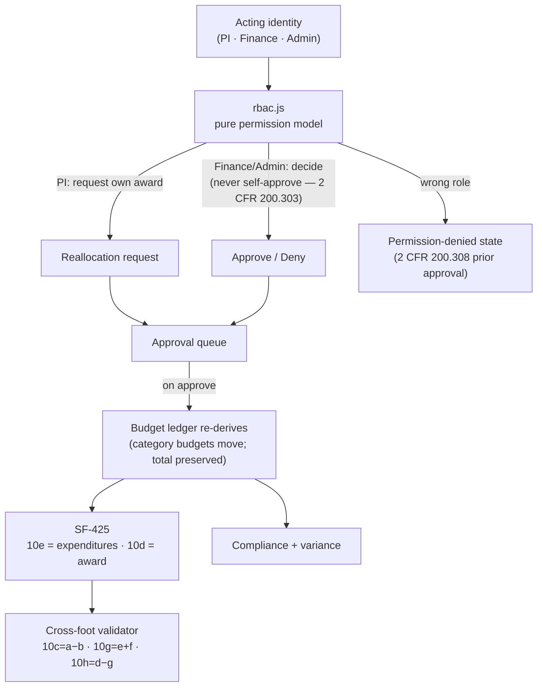

# Grant Tracker — "From typewriter to database"

**A federal grant-management command center for the people who actually run the awards.**
Multi-year awards, budget-vs-actuals by category, RBAC-gated reallocation approvals, 2 CFR 200
compliance findings, and SF-425 federal reports that **cross-foot to the ledger** — one editorial
workspace for principal investigators, grants administrators, and sponsored-programs finance staff.

`React` · `Vite` · `JavaScript` · token-driven design system · role-aware cockpit

**▶ [Live demo](https://garthpuckerin-grant-tracker.vercel.app)** · [Case study](https://garthpuckerin.com/project-granttracker) · [garthpuckerin.com](https://garthpuckerin.com)

> **This is the cockpit, not the engine.** A sanitized, mock-data demo of the product experience.
> The production backend — real authentication and server-enforced RBAC, persistence, the audit
> trail, and federal reporting integrations (SF-425 submission, SAM.gov / Grants.gov / Research.gov)
> — is a separate private codebase. See [What's real vs. illustrative](#whats-real-vs-illustrative).

---

## The problem

Federal grants administration is compliance-heavy and unforgiving: money is authorized by category
and can't be moved without prior approval, expenditures have to reconcile to the penny across
budgets and federal reports, and a wrong figure on an SF-425 is an audit finding. Most teams run it
on a patchwork of spreadsheets and an ERP export. The first version of this system replaced a
literal **typewriter-and-spreadsheet** process at a university grants office in 1998; this is that
system rebuilt 28 years later, by someone who has actually run the workflow.

## What it shows

- **Portfolio** of multi-year federal awards — sponsor, period of performance, award status, burn rate
- **Budgets** by category (personnel, equipment, supplies, travel, F&A/indirect) with spent,
  encumbered, and balance — every figure reconciled to the award
- **RBAC-gated reallocation approvals** *(signature workflow)* — a PI requests moving funds between
  categories; **Finance approves under 2 CFR 200.308**; the budget re-derives on approval. Switch the
  acting role and the permissions genuinely change — including the **permission-denied state** and
  the separation-of-duties rule that no one approves their own request (2 CFR 200.303).
- **SF-425 federal financial report** *(signature workflow)* — the full OMB No. 4040-0014 line
  structure (10a–10o + indirect), where **every figure is derived from the award's budget and
  expenditures** and a live validator proves the report **cross-foots** before it can be certified.
- **Compliance** — a portfolio rule engine (2 CFR 200, NIH GPS, NSF PAPPG, institutional) whose
  score, findings, and per-grant slices all derive from **one dataset**, so the numbers can't diverge
- **Everything works end to end on mock data** — open a task and complete it, resolve a compliance
  finding, dismiss an insight, add a document, invite a member, certify a filing — and the change
  re-derives across every screen that shows it (sidebar counts, dashboard, the grant's tabs)
- **A welcome tour for non-experts** — what an award is, the vocabulary (PI, F&A, period of
  performance, SF-425…), and the role you'll act as; replayable from Help
- **A real phone UI** — bottom tab bar, labeled card-lists instead of tables, full-screen sheets
- **Multi-agent AI insights**, documents, tasks, members, and a token-driven design system
  (light / beige / dark + density) that applies live

## Architecture — the numbers can't lie

Two disciplines carry the whole demo. **Coherence:** compliance and budget figures derive from a
single dataset, so a grant's line-items, its year totals, and the masthead all agree — and an
approved reallocation moves budget everywhere at once. **Authority:** the reallocation workflow is
gated by a pure permission model, so the acting role changes what you can *do*, not just what you see.



See [docs/architecture.md](docs/architecture.md) for the derivation and RBAC model in detail.

## What's real vs. illustrative

Honesty matters more than polish, so here's the exact boundary:

| Aspect | In this public demo | In the private production build |
|---|---|---|
| **Data** | Mock fixtures, deterministically date-shifted so the portfolio always looks current | Real awards via ERP / Workday Financials feed |
| **RBAC** | **Real permission logic** (`rbac.js`) — the acting-role switch genuinely changes what's permitted | Real SSO auth + server-enforced RBAC, per-action, with an audit log |
| **Reallocation approval** | **Real** request → approve/deny state machine, separation of duties, and live budget re-derivation — in memory | Same, persisted, wired to sponsor prior-approval and notifications |
| **SF-425** | **Real** cross-footing derivation from the ledger; validator blocks a report that doesn't tie out | Same, on real data, with e-submission to sponsor portals |
| **Compliance** | Derived from one dataset (2 CFR 200 / NIH / NSF rules) so views can't diverge | Real rule engine + SAM.gov / Grants.gov / Research.gov connectivity |
| **Persistence** | In-memory / localStorage | Postgres with row-level security and an immutable audit trail |
| **Backend** | None — frontend only | Private codebase (auth, database, integrations, reporting) |

The production engine is private by design — the demo proves the *product experience, the federal
domain fluency, and the data-modeling discipline*; the engine is the IP.

## Run it locally

```bash
npm install
npm run dev        # Vite dev server
npm run build      # production build
npm run test:unit  # RBAC permission-matrix tests (node --test)
npm run test:e2e   # Playwright smoke tests
```

## Stack

React 18 · Vite · JavaScript · a token-driven design system (theme / density) · `node --test` for the
permission model · Playwright for e2e. No backend — every figure is derived client-side from the mock
award ledger.

---

*Built by [Garth Puckerin](https://garthpuckerin.com). One system revealed every Thursday.*
