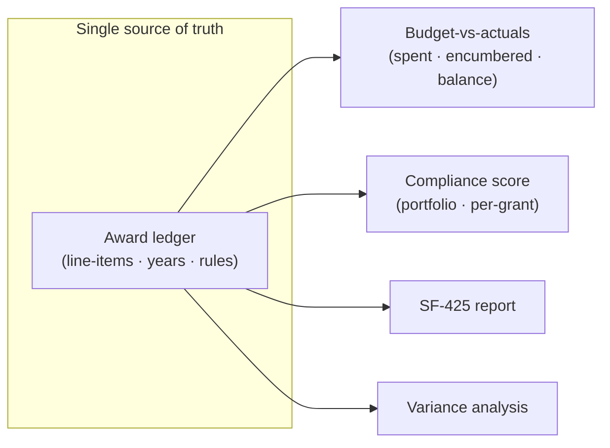
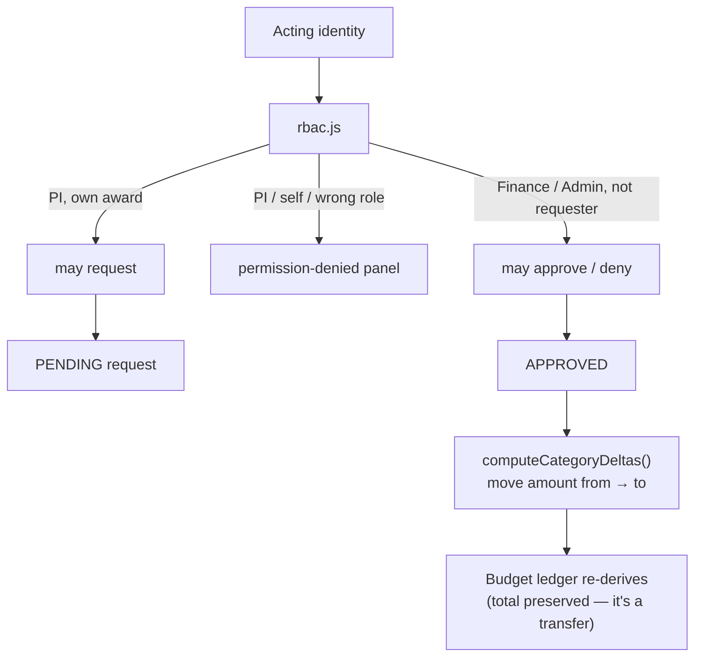

# Architecture

Grant Tracker's cockpit rests on two disciplines a grants administrator would notice immediately:
**coherence** (every figure reconciles to one ledger) and **authority** (what you can do is decided
by a real permission model, not a cosmetic label). Demo data that doesn't reconcile, or a role switch
that changes nothing, is exactly what makes a compliance tool read as fake — so neither happens here.

## The single-dataset model

Compliance and budget figures derive from one dataset. A grant's line-items sum to its year award,
the year totals sum to the masthead, and the portfolio compliance score, the per-grant slice, and the
dashboard posture are all reductions of the same rule set — so no two views can disagree.

## The RBAC reallocation workflow

Moving federal funds between budget categories requires sponsor/institution prior approval
(2 CFR 200.308) and a separation of duties between the requester and the approver (2 CFR 200.303).
`rbac.js` encodes exactly that as a pure, tested permission model, so switching the acting identity
(PI / Finance / Admin) produces genuinely different, permission-correct views.

- **`canRequestReallocation(user, grant)`** — Admin any award; PI only awards they lead; Finance never
  originates a request.
- **`canDecideReallocation(user, realloc)`** — Finance/Admin, and **never the requester** (no
  self-approval), enforcing separation of duties.
- On approval, `computeCategoryDeltas()` moves the amount from the source category to the destination;
  because it is a transfer, the award total is preserved and the ledger stays reconciled.

## The SF-425 cross-foot

The SF-425 (OMB No. 4040-0014) is derived entirely from the award. `buildSF425(grant)` computes the
OMB arithmetic and a live validator re-checks it before the report can be certified:

- `10c = 10a − 10b` (cash on hand)
- `10g = 10e + 10f` (total federal share)
- `10h = 10d − 10g` (unobligated balance)
- `10k = 10i − 10j` (recipient share remaining)
- `10o = 10l − 10m − 10n` (unexpended program income)

and the two tie-outs that matter: **10e (federal share of expenditures) = the grant's Expended
total**, and **10d (total federal funds authorized) = the Total Award** — so the federal report can
never float free of the budget screen.

## The design system

A token-driven system on two axes — **theme** (light / beige / dark) and **density** — so every
surface re-derives from a handful of variables. Appearance settings apply live and persist.

## What's not here

The backend, authentication and server-enforced RBAC, persistence, the audit trail, and the federal
reporting integrations (SF-425 submission, SAM.gov / Grants.gov / Research.gov) are a separate private
codebase. This repo is the **cockpit** — it proves the product experience, the federal domain fluency,
and the data-modeling discipline; the engine is the IP. See the
[real-vs-illustrative table](../README.md#whats-real-vs-illustrative) in the README.
